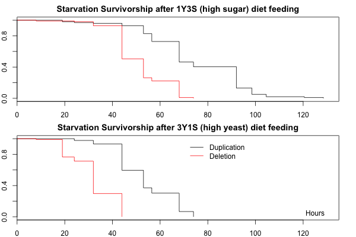
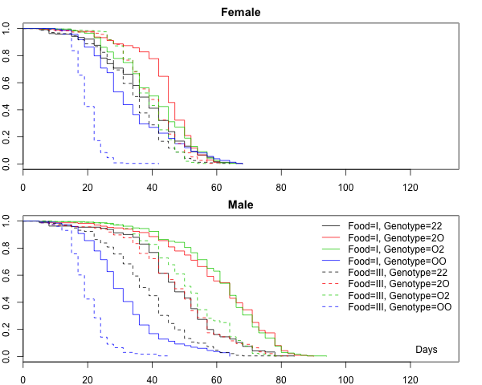
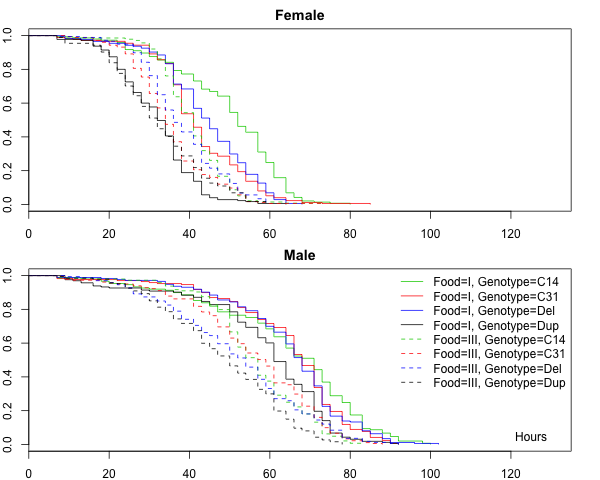
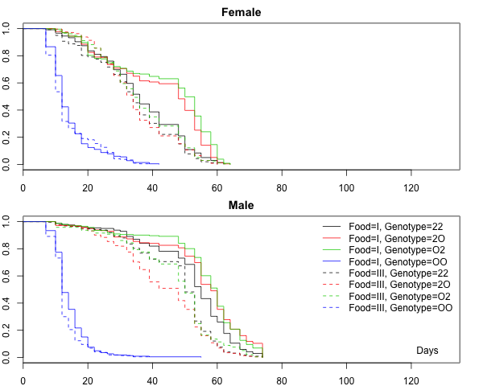
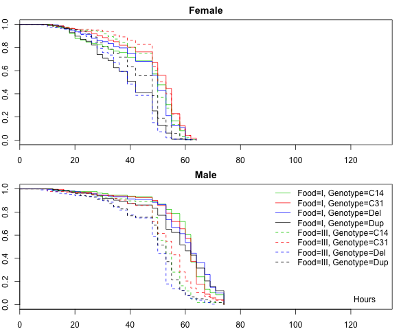
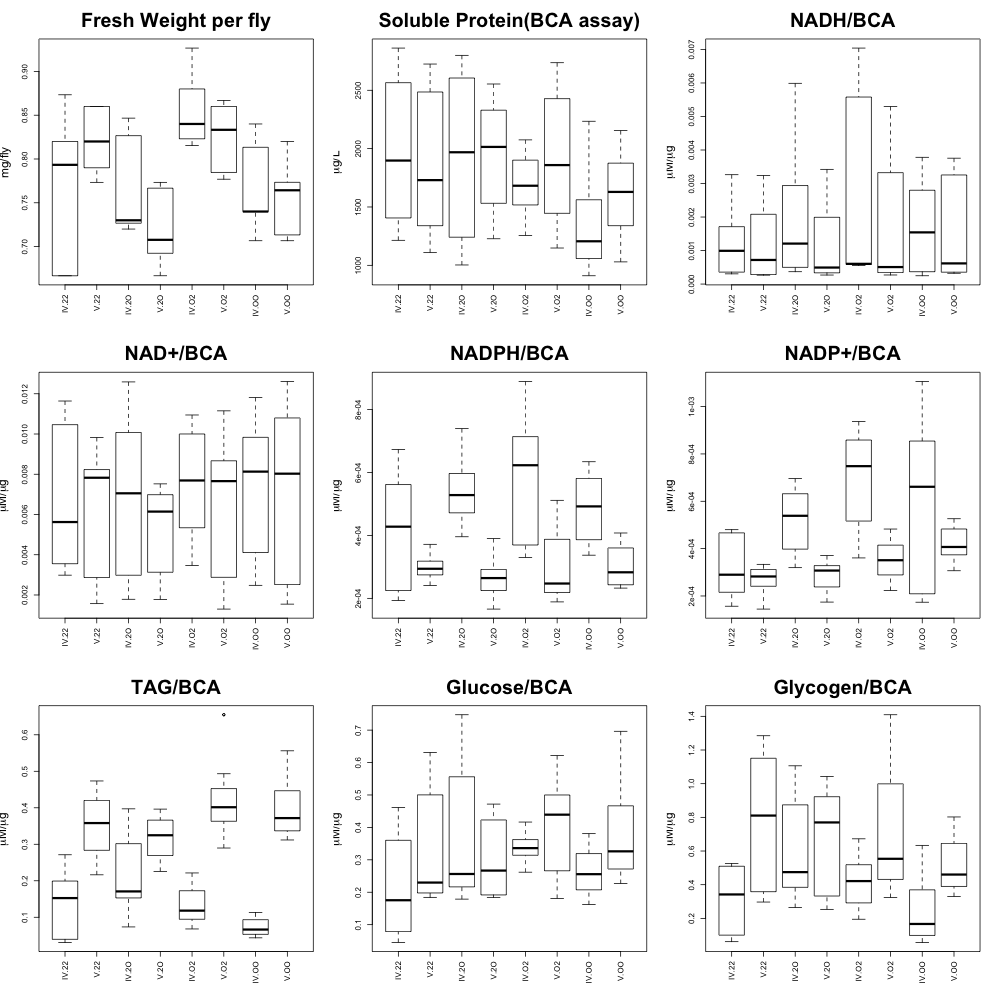
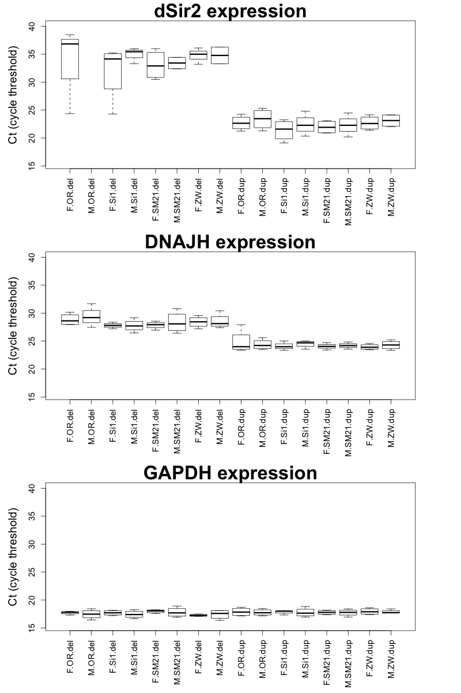
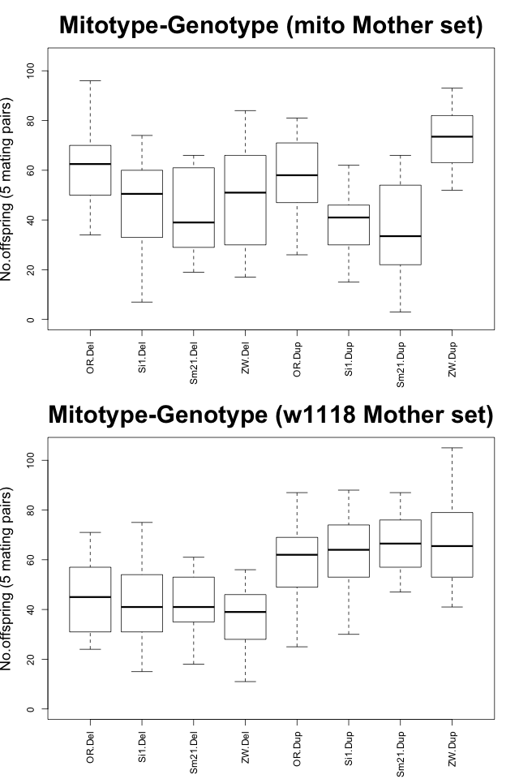
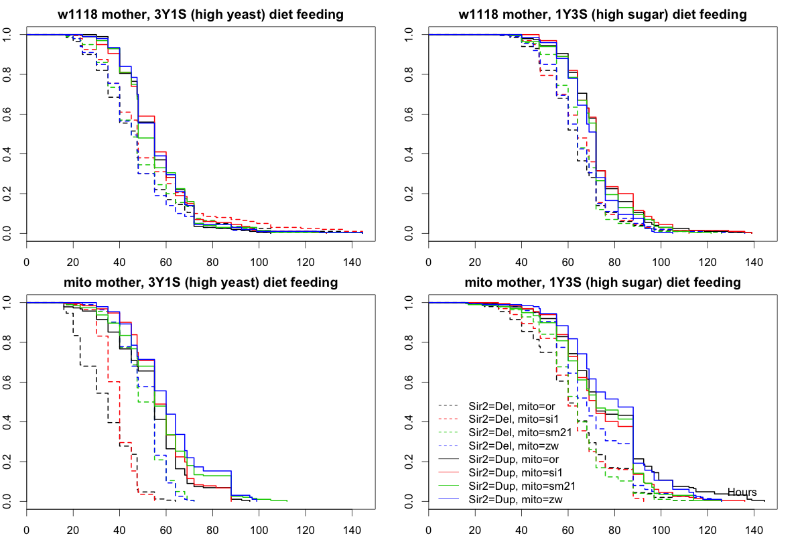

```python
import matplotlib as mpl
import matplotlib.pyplot as plt
import os
import rpy2.robjects as robjects
from rpy2.robjects import pandas2ri
import pandas.rpy.common as com
import pandas as pd
import numpy as np

%matplotlib inline
%load_ext rpy2.ipython

pd.set_option('display.precision', 3)
plt.rcParams['font.family'] = 'Arial'
pandas2ri.activate()

def prob_to_code(v):
    '''
    Convert P values to significance codes:
    less than 0.001: ***
    (0.01, 0.001]  : **
    (0.05, 0.01]   : *
    (0.1, 0.05]    : +

    prob_to_code(v)
    v: float
    '''
    if   0.1  >v>=0.05:
        return '+'
    elif 0.05 >v>=0.01:
        return '*'
    elif 0.01 >v>=0.001:
        return '**'
    elif 0.001>v>=0:
        return '***'
    else:
        return ''
```

    /Users/user/anaconda/lib/python2.7/site-packages/ipykernel/__main__.py:6: FutureWarning: The pandas.rpy module is deprecated and will be removed in a future version. We refer to external packages like rpy2. 
    See here for a guide on how to port your code to rpy2: http://pandas.pydata.org/pandas-docs/stable/r_interface.html


```python
table_list = []
os.getcwd()
```


    '/Users/user/Work/Sir2_figs'


# Figure 1 and Table 1

- Deletion genotype has shorter starvation survivorship
- High sugar diet improves starvation survivorship
- High sugar diet has slightly stronger effect on deletion genotype


```python
%%R -w 600 -h 400
library(survival)
setwd('/Users/user/Work/Sir2_figs')
df <- read.csv('Sir2_dup_del_stv.csv')
S1 <- survfit(Surv(time)~Food+Geno, conf.type="none", 
              data=df[(df$Food=='V')&((df$Geno=='22')|(df$Geno=='OO')),])
S2 <- survfit(Surv(time)~Food+Geno, conf.type="none",
              data=df[(df$Food=='IV')&((df$Geno=='22')|(df$Geno=='OO')),])
par(mfrow=c(2,1))
par(mar=c(2,2,2,2))
CLS <- c(1,2,3,4)
plot(S1, main="Starvation Survivorship after 1Y3S (high sugar) diet feeding", lty=1, lwd=1, col=CLS, xlim=c(0,135))
plot(S2, main="Starvation Survivorship after 3Y1S (high yeast) diet feeding", lty=1, lwd=1, col=CLS, xlim=c(0,135))
text(125, 0.05, 'Hours')
legend(70, 1., c('Duplication', 'Deletion'), 
       bty='n', lty=1, lwd=1, col=CLS)
mdl <- coxph(Surv(time)~Food*Geno, data=droplevels(df[((df$Geno=='22')|(df$Geno=='OO')),]))
S <- summary(mdl)
C <- printCoefmat(S$coefficient, digits=3)
```


                   coef exp(coef) se(coef)     z Pr(>|z|)    
    FoodV        -1.410     0.244    0.176 -8.01  1.1e-15 ***
    GenoOO        2.174     8.795    0.181 12.03  < 2e-16 ***
    FoodV:GenoOO -0.501     0.606    0.239 -2.09    0.036 *  
    ---
    Signif. codes:  0 ‘***’ 0.001 ‘**’ 0.01 ‘*’ 0.05 ‘.’ 0.1 ‘ ’ 1





```python
temp_df = com.convert_robj((robjects.globalenv.get('S').rx2('coefficients')))
temp_df[' '] = map(prob_to_code, temp_df['Pr(>|z|)'])
table_list.append(temp_df.to_html())
temp_df
```


<div>
<table border="1" class="dataframe">
  <thead>
    <tr style="text-align: right;">
      <th></th>
      <th>coef</th>
      <th>exp(coef)</th>
      <th>se(coef)</th>
      <th>z</th>
      <th>Pr(&gt;|z|)</th>
      <th></th>
    </tr>
  </thead>
  <tbody>
    <tr>
      <th>FoodV</th>
      <td>-1.410</td>
      <td>0.244</td>
      <td>0.176</td>
      <td>-8.014</td>
      <td>1.110e-15</td>
      <td>***</td>
    </tr>
    <tr>
      <th>GenoOO</th>
      <td>2.174</td>
      <td>8.795</td>
      <td>0.181</td>
      <td>12.032</td>
      <td>0.000e+00</td>
      <td>***</td>
    </tr>
    <tr>
      <th>FoodV:GenoOO</th>
      <td>-0.501</td>
      <td>0.606</td>
      <td>0.239</td>
      <td>-2.093</td>
      <td>3.637e-02</td>
      <td>*</td>
    </tr>
  </tbody>
</table>
</div>


```python
coeff_list = []
```

# Lifespan (Figures 2, 3, 4, 5)


```python
%%R -w 600 -h 480
library(survival)
setwd('/Users/user/Work/Sir2_figs')
df <- read.csv('Sir2_LS_Rep1.csv')
S1 <- survfit(Surv(time)~Food+Genotype, conf.type="none", data=df[df$Sex=='F',])
S2 <- survfit(Surv(time)~Food+Genotype, conf.type="none", data=df[df$Sex=='M',])
par(mfrow=c(2,1))
par(mar=c(2,2,2,2))
CLS <- c(1,2,3,4)
LTY <- rep(c(1,2), each=4)
plot(S1, main="Female", lty=LTY, lwd=1, col=CLS, xlim=c(0,135))
plot(S2, main="Male", lty=LTY, lwd=1, col=CLS, xlim=c(0,135))
text(125, 0.05, 'Days')
legend(90, 1.05, names(S1$strata), 
       bty='n', 
       lty=LTY, lwd=1, col=CLS)
mdl <- coxph(Surv(time)~Food*Genotype*Sex, data=df)
S <- summary(mdl)
C <- printCoefmat(S$coefficient, digits=3)
```


                               coef exp(coef) se(coef)      z Pr(>|z|)    
    FoodIII                  0.3685    1.4455   0.0914   4.03  5.5e-05 ***
    Genotype2O              -0.3826    0.6821   0.0913  -4.19  2.8e-05 ***
    GenotypeO2              -0.1886    0.8281   0.0919  -2.05  0.04015 *  
    GenotypeOO               0.1786    1.1955   0.0918   1.95  0.05170 .  
    SexM                    -0.9641    0.3813   0.0924 -10.43  < 2e-16 ***
    FoodIII:Genotype2O       0.0400    1.0408   0.1298   0.31  0.75796    
    FoodIII:GenotypeO2      -0.0186    0.9815   0.1290  -0.14  0.88510    
    FoodIII:GenotypeOO       1.9568    7.0768   0.1350  14.50  < 2e-16 ***
    FoodIII:SexM             0.4695    1.5992   0.1297   3.62  0.00030 ***
    Genotype2O:SexM         -0.5008    0.6060   0.1310  -3.82  0.00013 ***
    GenotypeO2:SexM         -0.6915    0.5008   0.1311  -5.28  1.3e-07 ***
    GenotypeOO:SexM          1.2109    3.3565   0.1301   9.31  < 2e-16 ***
    FoodIII:Genotype2O:SexM  0.0231    1.0233   0.1842   0.13  0.90033    
    FoodIII:GenotypeO2:SexM -0.0570    0.9446   0.1846  -0.31  0.75750    
    FoodIII:GenotypeOO:SexM -0.9770    0.3764   0.1840  -5.31  1.1e-07 ***
    ---
    Signif. codes:  0 ‘***’ 0.001 ‘**’ 0.01 ‘*’ 0.05 ‘.’ 0.1 ‘ ’ 1





```python
coeff_list.append(com.convert_robj(robjects.globalenv.get('S').rx2('coefficients')))
```


```python
%%R -w 600 -h 480
library(survival)
setwd('/Users/user/Work/Sir2_figs')
df <- read.csv('Sir2_LS_Rep2.csv')
S1 <- survfit(Surv(time)~Food+Genotype, conf.type="none", data=df[df$Sex=='F',])
S2 <- survfit(Surv(time)~Food+Genotype, conf.type="none", data=df[df$Sex=='M',])
par(mfrow=c(2,1))
par(mar=c(2,2,2,2))
CLS <- c(3,2,4,1)
LTY <- rep(c(1,2), each=4)
plot(S1, main="Female", lty=LTY, lwd=1, col=CLS, xlim=c(0,135))
plot(S2, main="Male", lty=LTY, lwd=1, col=CLS, xlim=c(0,135))
text(125, 0.05, 'Hours')
legend(90, 1.05, names(S1$strata), 
       bty='n', lty=LTY, lwd=1, col=CLS)
mdl <- coxph(Surv(time)~Food*Genotype*Sex, data=df)
S <- summary(mdl)
C <- printCoefmat(S$coefficient, digits=3)
```


                                 coef exp(coef) se(coef)      z Pr(>|z|)    
    FoodIII                   0.88630   2.42613  0.12061   7.35  2.0e-13 ***
    GenotypeC31               0.55482   1.74163  0.11284   4.92  8.8e-07 ***
    GenotypeDel               0.49878   1.64671  0.11298   4.41  1.0e-05 ***
    GenotypeDup               1.62255   5.06601  0.11558  14.04  < 2e-16 ***
    SexM                     -1.36866   0.25445  0.12176 -11.24  < 2e-16 ***
    FoodIII:GenotypeC31      -0.19463   0.82314  0.16036  -1.21    0.225    
    FoodIII:GenotypeDel      -0.34035   0.71152  0.16023  -2.12    0.034 *  
    FoodIII:GenotypeDup      -1.09712   0.33383  0.16203  -6.77  1.3e-11 ***
    FoodIII:SexM             -0.00324   0.99677  0.16949  -0.02    0.985    
    GenotypeC31:SexM         -0.35317   0.70246  0.16016  -2.21    0.027 *  
    GenotypeDel:SexM         -0.33186   0.71759  0.15931  -2.08    0.037 *  
    GenotypeDup:SexM         -1.06961   0.34314  0.16298  -6.56  5.3e-11 ***
    FoodIII:GenotypeC31:SexM -0.13514   0.87359  0.22617  -0.60    0.550    
    FoodIII:GenotypeDel:SexM  0.15112   1.16314  0.22684   0.67    0.505    
    FoodIII:GenotypeDup:SexM  0.95913   2.60942  0.22755   4.22  2.5e-05 ***
    ---
    Signif. codes:  0 ‘***’ 0.001 ‘**’ 0.01 ‘*’ 0.05 ‘.’ 0.1 ‘ ’ 1





```python
coeff_list.append(com.convert_robj(robjects.globalenv.get('S').rx2('coefficients')))
```


```python
%%R -w 600 -h 480
library(survival)
setwd('/Users/user/Work/Sir2_figs')
df <- read.csv('Sir2_LS_Rep3_deldup.csv')
S1 <- survfit(Surv(time)~Food+Genotype, conf.type="none", data=df[df$Sex=='F',])
S2 <- survfit(Surv(time)~Food+Genotype, conf.type="none", data=df[df$Sex=='M',])
par(mfrow=c(2,1))
par(mar=c(2,2,2,2))
CLS <- c(1,2,3,4)
LTY <- rep(c(1,2), each=4)
plot(S1, main="Female", lty=LTY, lwd=1, col=CLS, xlim=c(0,135))
plot(S2, main="Male", lty=LTY, lwd=1, col=CLS, xlim=c(0,135))
text(125, 0.05, 'Days')
legend(90, 1.05, names(S1$strata), 
       bty='n', 
       lty=LTY, lwd=1, col=CLS)
mdl <- coxph(Surv(time)~Food*Genotype*Sex, data=df)
S <- summary(mdl)
C <- printCoefmat(S$coefficient, digits=3)
```


                               coef exp(coef) se(coef)      z Pr(>|z|)    
    FoodIII                  0.2313    1.2602   0.0900   2.57  0.01017 *  
    Genotype2O              -0.4994    0.6069   0.0925  -5.40  6.8e-08 ***
    GenotypeO2              -0.7275    0.4831   0.0930  -7.82  5.3e-15 ***
    GenotypeOO               2.1476    8.5647   0.0986  21.78  < 2e-16 ***
    SexM                    -1.3592    0.2569   0.0943 -14.41  < 2e-16 ***
    FoodIII:Genotype2O       0.4443    1.5594   0.1286   3.46  0.00055 ***
    FoodIII:GenotypeO2       0.5538    1.7398   0.1292   4.29  1.8e-05 ***
    FoodIII:GenotypeOO      -0.1611    0.8512   0.1318  -1.22  0.22167    
    FoodIII:SexM             0.2899    1.3362   0.1297   2.23  0.02544 *  
    Genotype2O:SexM          0.1571    1.1701   0.1326   1.18  0.23608    
    GenotypeO2:SexM          0.4004    1.4924   0.1311   3.06  0.00225 ** 
    GenotypeOO:SexM          1.3530    3.8689   0.1338  10.12  < 2e-16 ***
    FoodIII:Genotype2O:SexM  0.0914    1.0957   0.1853   0.49  0.62193    
    FoodIII:GenotypeO2:SexM -0.2918    0.7469   0.1841  -1.58  0.11302    
    FoodIII:GenotypeOO:SexM -0.0643    0.9377   0.1875  -0.34  0.73166    
    ---
    Signif. codes:  0 ‘***’ 0.001 ‘**’ 0.01 ‘*’ 0.05 ‘.’ 0.1 ‘ ’ 1





```python
coeff_list.append(com.convert_robj(robjects.globalenv.get('S').rx2('coefficients')))
```


```python
%%R -w 600 -h 480
library(survival)
setwd('/Users/user/Work/Sir2_figs')
df <- read.csv('Sir2_LS_Rep3_overw1118.csv')
S1 <- survfit(Surv(time)~Food+Genotype, conf.type="none", data=df[df$Sex=='F',])
S2 <- survfit(Surv(time)~Food+Genotype, conf.type="none", data=df[df$Sex=='M',])
par(mfrow=c(2,1))
par(mar=c(2,2,2,2))
CLS <- c(3,2,4,1)
LTY <- rep(c(1,2), each=4)
plot(S1, main="Female", lty=LTY, lwd=1, col=CLS, xlim=c(0,135))
plot(S2, main="Male", lty=LTY, lwd=1, col=CLS, xlim=c(0,135))
text(125, 0.05, 'Hours')
legend(90, 1.05, names(S1$strata), 
       bty='n', lty=LTY, lwd=1, col=CLS)
mdl <- coxph(Surv(time)~Food*Genotype*Sex, data=df)
S <- summary(mdl)
C <- printCoefmat(S$coefficient, digits=3)
```


                                 coef exp(coef) se(coef)      z Pr(>|z|)    
    FoodIII                   0.05866   1.06041  0.09356   0.63   0.5307    
    GenotypeC31              -0.24239   0.78475  0.09445  -2.57   0.0103 *  
    GenotypeDel               0.07293   1.07565  0.09307   0.78   0.4333    
    GenotypeDup               0.83033   2.29407  0.09345   8.89  < 2e-16 ***
    SexM                     -1.49047   0.22527  0.09828 -15.17  < 2e-16 ***
    FoodIII:GenotypeC31      -0.00578   0.99424  0.13160  -0.04   0.9650    
    FoodIII:GenotypeDel       0.82635   2.28496  0.13132   6.29  3.1e-10 ***
    FoodIII:GenotypeDup      -0.39779   0.67180  0.13070  -3.04   0.0023 ** 
    FoodIII:SexM              0.93066   2.53619  0.13423   6.93  4.1e-12 ***
    GenotypeC31:SexM          0.36574   1.44159  0.13517   2.71   0.0068 ** 
    GenotypeDel:SexM         -0.14182   0.86778  0.13445  -1.05   0.2915    
    GenotypeDup:SexM         -0.82422   0.43858  0.13398  -6.15  7.7e-10 ***
    FoodIII:GenotypeC31:SexM -0.49433   0.60998  0.18959  -2.61   0.0091 ** 
    FoodIII:GenotypeDel:SexM -0.42243   0.65545  0.18819  -2.24   0.0248 *  
    FoodIII:GenotypeDup:SexM  0.45255   1.57231  0.18717   2.42   0.0156 *  
    ---
    Signif. codes:  0 ‘***’ 0.001 ‘**’ 0.01 ‘*’ 0.05 ‘.’ 0.1 ‘ ’ 1





```python
coeff_list.append(com.convert_robj(robjects.globalenv.get('S').rx2('coefficients')))
```

# Cox regression for lifespan (Table 2, 3)

- only looking at the repeatable effects (labeled as `Both_sig`)


```python
Del_dup_coxph = pd.concat((coeff_list[0], coeff_list[2]), 
                          keys = ['Replicate1', 'Replicate2'], axis=1)
Del_dup_coxph['Both_sig'] = np.where(((Del_dup_coxph.iloc[:, [4,9]] < 0.1).all(1) & 
                                      ((np.sign(Del_dup_coxph.iloc[:, [0,5]])).sum(1)!=0)), '*', '')
Del_dup_coxph
```


<div>
<table border="1" class="dataframe">
  <thead>
    <tr>
      <th></th>
      <th colspan="5" halign="left">Replicate1</th>
      <th colspan="5" halign="left">Replicate2</th>
      <th>Both_sig</th>
    </tr>
    <tr>
      <th></th>
      <th>coef</th>
      <th>exp(coef)</th>
      <th>se(coef)</th>
      <th>z</th>
      <th>Pr(&gt;|z|)</th>
      <th>coef</th>
      <th>exp(coef)</th>
      <th>se(coef)</th>
      <th>z</th>
      <th>Pr(&gt;|z|)</th>
      <th></th>
    </tr>
  </thead>
  <tbody>
    <tr>
      <th>FoodIII</th>
      <td>0.368</td>
      <td>1.445</td>
      <td>0.091</td>
      <td>4.032</td>
      <td>5.541e-05</td>
      <td>0.231</td>
      <td>1.260</td>
      <td>0.090</td>
      <td>2.570</td>
      <td>1.017e-02</td>
      <td>*</td>
    </tr>
    <tr>
      <th>Genotype2O</th>
      <td>-0.383</td>
      <td>0.682</td>
      <td>0.091</td>
      <td>-4.190</td>
      <td>2.795e-05</td>
      <td>-0.499</td>
      <td>0.607</td>
      <td>0.093</td>
      <td>-5.398</td>
      <td>6.752e-08</td>
      <td>*</td>
    </tr>
    <tr>
      <th>GenotypeO2</th>
      <td>-0.189</td>
      <td>0.828</td>
      <td>0.092</td>
      <td>-2.052</td>
      <td>4.015e-02</td>
      <td>-0.728</td>
      <td>0.483</td>
      <td>0.093</td>
      <td>-7.820</td>
      <td>5.329e-15</td>
      <td>*</td>
    </tr>
    <tr>
      <th>GenotypeOO</th>
      <td>0.179</td>
      <td>1.196</td>
      <td>0.092</td>
      <td>1.946</td>
      <td>5.170e-02</td>
      <td>2.148</td>
      <td>8.565</td>
      <td>0.099</td>
      <td>21.781</td>
      <td>0.000e+00</td>
      <td>*</td>
    </tr>
    <tr>
      <th>SexM</th>
      <td>-0.964</td>
      <td>0.381</td>
      <td>0.092</td>
      <td>-10.431</td>
      <td>0.000e+00</td>
      <td>-1.359</td>
      <td>0.257</td>
      <td>0.094</td>
      <td>-14.414</td>
      <td>0.000e+00</td>
      <td>*</td>
    </tr>
    <tr>
      <th>FoodIII:Genotype2O</th>
      <td>0.040</td>
      <td>1.041</td>
      <td>0.130</td>
      <td>0.308</td>
      <td>7.580e-01</td>
      <td>0.444</td>
      <td>1.559</td>
      <td>0.129</td>
      <td>3.455</td>
      <td>5.497e-04</td>
      <td></td>
    </tr>
    <tr>
      <th>FoodIII:GenotypeO2</th>
      <td>-0.019</td>
      <td>0.982</td>
      <td>0.129</td>
      <td>-0.145</td>
      <td>8.851e-01</td>
      <td>0.554</td>
      <td>1.740</td>
      <td>0.129</td>
      <td>4.287</td>
      <td>1.812e-05</td>
      <td></td>
    </tr>
    <tr>
      <th>FoodIII:GenotypeOO</th>
      <td>1.957</td>
      <td>7.077</td>
      <td>0.135</td>
      <td>14.496</td>
      <td>0.000e+00</td>
      <td>-0.161</td>
      <td>0.851</td>
      <td>0.132</td>
      <td>-1.222</td>
      <td>2.217e-01</td>
      <td></td>
    </tr>
    <tr>
      <th>FoodIII:SexM</th>
      <td>0.469</td>
      <td>1.599</td>
      <td>0.130</td>
      <td>3.619</td>
      <td>2.959e-04</td>
      <td>0.290</td>
      <td>1.336</td>
      <td>0.130</td>
      <td>2.235</td>
      <td>2.544e-02</td>
      <td>*</td>
    </tr>
    <tr>
      <th>Genotype2O:SexM</th>
      <td>-0.501</td>
      <td>0.606</td>
      <td>0.131</td>
      <td>-3.824</td>
      <td>1.314e-04</td>
      <td>0.157</td>
      <td>1.170</td>
      <td>0.133</td>
      <td>1.185</td>
      <td>2.361e-01</td>
      <td></td>
    </tr>
    <tr>
      <th>GenotypeO2:SexM</th>
      <td>-0.691</td>
      <td>0.501</td>
      <td>0.131</td>
      <td>-5.276</td>
      <td>1.323e-07</td>
      <td>0.400</td>
      <td>1.492</td>
      <td>0.131</td>
      <td>3.055</td>
      <td>2.250e-03</td>
      <td></td>
    </tr>
    <tr>
      <th>GenotypeOO:SexM</th>
      <td>1.211</td>
      <td>3.356</td>
      <td>0.130</td>
      <td>9.308</td>
      <td>0.000e+00</td>
      <td>1.353</td>
      <td>3.869</td>
      <td>0.134</td>
      <td>10.115</td>
      <td>0.000e+00</td>
      <td>*</td>
    </tr>
    <tr>
      <th>FoodIII:Genotype2O:SexM</th>
      <td>0.023</td>
      <td>1.023</td>
      <td>0.184</td>
      <td>0.125</td>
      <td>9.003e-01</td>
      <td>0.091</td>
      <td>1.096</td>
      <td>0.185</td>
      <td>0.493</td>
      <td>6.219e-01</td>
      <td></td>
    </tr>
    <tr>
      <th>FoodIII:GenotypeO2:SexM</th>
      <td>-0.057</td>
      <td>0.945</td>
      <td>0.185</td>
      <td>-0.309</td>
      <td>7.575e-01</td>
      <td>-0.292</td>
      <td>0.747</td>
      <td>0.184</td>
      <td>-1.585</td>
      <td>1.130e-01</td>
      <td></td>
    </tr>
    <tr>
      <th>FoodIII:GenotypeOO:SexM</th>
      <td>-0.977</td>
      <td>0.376</td>
      <td>0.184</td>
      <td>-5.310</td>
      <td>1.095e-07</td>
      <td>-0.064</td>
      <td>0.938</td>
      <td>0.187</td>
      <td>-0.343</td>
      <td>7.317e-01</td>
      <td></td>
    </tr>
  </tbody>
</table>
</div>


```python
Over_w1118_coxph = pd.concat((coeff_list[1], coeff_list[3]), 
                             keys = ['Replicate1', 'Replicate2'], axis=1)
Over_w1118_coxph['Both_sig'] = np.where(((Over_w1118_coxph.iloc[:, [4,9]] < 0.1).all(1) & 
                                         ((np.sign(Over_w1118_coxph.iloc[:, [0,5]])).sum(1)!=0)), '*', '')
Over_w1118_coxph
```


<div>
<table border="1" class="dataframe">
  <thead>
    <tr>
      <th></th>
      <th colspan="5" halign="left">Replicate1</th>
      <th colspan="5" halign="left">Replicate2</th>
      <th>Both_sig</th>
    </tr>
    <tr>
      <th></th>
      <th>coef</th>
      <th>exp(coef)</th>
      <th>se(coef)</th>
      <th>z</th>
      <th>Pr(&gt;|z|)</th>
      <th>coef</th>
      <th>exp(coef)</th>
      <th>se(coef)</th>
      <th>z</th>
      <th>Pr(&gt;|z|)</th>
      <th></th>
    </tr>
  </thead>
  <tbody>
    <tr>
      <th>FoodIII</th>
      <td>0.886</td>
      <td>2.426</td>
      <td>0.121</td>
      <td>7.348</td>
      <td>2.010e-13</td>
      <td>0.059</td>
      <td>1.060</td>
      <td>0.094</td>
      <td>0.627</td>
      <td>5.307e-01</td>
      <td></td>
    </tr>
    <tr>
      <th>GenotypeC31</th>
      <td>0.555</td>
      <td>1.742</td>
      <td>0.113</td>
      <td>4.917</td>
      <td>8.797e-07</td>
      <td>-0.242</td>
      <td>0.785</td>
      <td>0.094</td>
      <td>-2.566</td>
      <td>1.028e-02</td>
      <td></td>
    </tr>
    <tr>
      <th>GenotypeDel</th>
      <td>0.499</td>
      <td>1.647</td>
      <td>0.113</td>
      <td>4.415</td>
      <td>1.012e-05</td>
      <td>0.073</td>
      <td>1.076</td>
      <td>0.093</td>
      <td>0.784</td>
      <td>4.333e-01</td>
      <td></td>
    </tr>
    <tr>
      <th>GenotypeDup</th>
      <td>1.623</td>
      <td>5.066</td>
      <td>0.116</td>
      <td>14.039</td>
      <td>0.000e+00</td>
      <td>0.830</td>
      <td>2.294</td>
      <td>0.093</td>
      <td>8.885</td>
      <td>0.000e+00</td>
      <td>*</td>
    </tr>
    <tr>
      <th>SexM</th>
      <td>-1.369</td>
      <td>0.254</td>
      <td>0.122</td>
      <td>-11.241</td>
      <td>0.000e+00</td>
      <td>-1.490</td>
      <td>0.225</td>
      <td>0.098</td>
      <td>-15.165</td>
      <td>0.000e+00</td>
      <td>*</td>
    </tr>
    <tr>
      <th>FoodIII:GenotypeC31</th>
      <td>-0.195</td>
      <td>0.823</td>
      <td>0.160</td>
      <td>-1.214</td>
      <td>2.249e-01</td>
      <td>-0.006</td>
      <td>0.994</td>
      <td>0.132</td>
      <td>-0.044</td>
      <td>9.650e-01</td>
      <td></td>
    </tr>
    <tr>
      <th>FoodIII:GenotypeDel</th>
      <td>-0.340</td>
      <td>0.712</td>
      <td>0.160</td>
      <td>-2.124</td>
      <td>3.366e-02</td>
      <td>0.826</td>
      <td>2.285</td>
      <td>0.131</td>
      <td>6.293</td>
      <td>3.124e-10</td>
      <td></td>
    </tr>
    <tr>
      <th>FoodIII:GenotypeDup</th>
      <td>-1.097</td>
      <td>0.334</td>
      <td>0.162</td>
      <td>-6.771</td>
      <td>1.278e-11</td>
      <td>-0.398</td>
      <td>0.672</td>
      <td>0.131</td>
      <td>-3.044</td>
      <td>2.338e-03</td>
      <td>*</td>
    </tr>
    <tr>
      <th>FoodIII:SexM</th>
      <td>-0.003</td>
      <td>0.997</td>
      <td>0.169</td>
      <td>-0.019</td>
      <td>9.848e-01</td>
      <td>0.931</td>
      <td>2.536</td>
      <td>0.134</td>
      <td>6.933</td>
      <td>4.110e-12</td>
      <td></td>
    </tr>
    <tr>
      <th>GenotypeC31:SexM</th>
      <td>-0.353</td>
      <td>0.702</td>
      <td>0.160</td>
      <td>-2.205</td>
      <td>2.745e-02</td>
      <td>0.366</td>
      <td>1.442</td>
      <td>0.135</td>
      <td>2.706</td>
      <td>6.813e-03</td>
      <td></td>
    </tr>
    <tr>
      <th>GenotypeDel:SexM</th>
      <td>-0.332</td>
      <td>0.718</td>
      <td>0.159</td>
      <td>-2.083</td>
      <td>3.725e-02</td>
      <td>-0.142</td>
      <td>0.868</td>
      <td>0.134</td>
      <td>-1.055</td>
      <td>2.915e-01</td>
      <td></td>
    </tr>
    <tr>
      <th>GenotypeDup:SexM</th>
      <td>-1.070</td>
      <td>0.343</td>
      <td>0.163</td>
      <td>-6.563</td>
      <td>5.278e-11</td>
      <td>-0.824</td>
      <td>0.439</td>
      <td>0.134</td>
      <td>-6.152</td>
      <td>7.666e-10</td>
      <td>*</td>
    </tr>
    <tr>
      <th>FoodIII:GenotypeC31:SexM</th>
      <td>-0.135</td>
      <td>0.874</td>
      <td>0.226</td>
      <td>-0.598</td>
      <td>5.502e-01</td>
      <td>-0.494</td>
      <td>0.610</td>
      <td>0.190</td>
      <td>-2.607</td>
      <td>9.126e-03</td>
      <td></td>
    </tr>
    <tr>
      <th>FoodIII:GenotypeDel:SexM</th>
      <td>0.151</td>
      <td>1.163</td>
      <td>0.227</td>
      <td>0.666</td>
      <td>5.053e-01</td>
      <td>-0.422</td>
      <td>0.655</td>
      <td>0.188</td>
      <td>-2.245</td>
      <td>2.479e-02</td>
      <td></td>
    </tr>
    <tr>
      <th>FoodIII:GenotypeDup:SexM</th>
      <td>0.959</td>
      <td>2.609</td>
      <td>0.228</td>
      <td>4.215</td>
      <td>2.498e-05</td>
      <td>0.453</td>
      <td>1.572</td>
      <td>0.187</td>
      <td>2.418</td>
      <td>1.561e-02</td>
      <td>*</td>
    </tr>
  </tbody>
</table>
</div>


```python
table_list.append(Del_dup_coxph.to_html())
table_list.append(Over_w1118_coxph.to_html())
```

# Metabolites (Figure S2, Table S1)


```python
%%R -w 1000 -h 1000
setwd('/Users/user/Work/Sir2_figs')
df   <- read.csv('Sir2_dup_del_Biochem_VIV.CSV')
par(mfrow=c(3,3))
umug=expression(paste(mu, 'M/', mu, 'g'))
boxplot(fly_per~food*genotype, data=df, main='Fresh Weight per fly', ylab='mg/fly', 
        cex.lab=1.5, las=3, cex.main=2.5)
boxplot(BCA~food*genotype, data=df, main='Soluble Protein(BCA assay)', ylab=expression(paste(mu, 'g/L')),
        cex.lab=1.5, las=3, cex.main=2.5)
boxplot(NADH_BCA~food*genotype, data=df, main='NADH/BCA', ylab=umug, cex.lab=1.5, las=3, cex.main=2.5)
boxplot(NAD_BCA~food*genotype, data=df, main='NAD+/BCA', ylab=umug, cex.lab=1.5, las=3, cex.main=2.5)
boxplot(NADPH_BCA~food*genotype, data=df, main='NADPH/BCA', ylab=umug, cex.lab=1.5, las=3, cex.main=2.5)
boxplot(NADP_BCA~food*genotype, data=df, main='NADP+/BCA', ylab=umug, cex.lab=1.5, las=3, cex.main=2.5)
boxplot(TAG_BCA~food*genotype, data=df, main='TAG/BCA', ylab=umug, cex.lab=1.5, las=3, cex.main=2.5)
boxplot(Glc_BCA~food*genotype, data=df, main='Glucose/BCA', ylab=umug, cex.lab=1.5, las=3, cex.main=2.5)
boxplot(Gly_BCA~food*genotype, data=df, main='Glycogen/BCA', ylab=umug, cex.lab=1.5, las=3, cex.main=2.5)
par(mfrow=c(1,1))
```





```python
%%R
setwd('/Users/user/Work/Sir2_figs')
df   <- read.csv('Sir2_dup_del_Biochem_VIV.CSV')

bc_model <- function(word){
  f = as.formula(paste(word, '~ (food*genotype) %in% Block + Block'))
  a = aov(f, data=df)
  return(summary(a))
}

result = lapply(list('fly_per', 'BCA', 'NADH_BCA', 'NAD_BCA', 'NADPH_BCA', 
                     'NADP_BCA', 'TAG_BCA', 'Glc_BCA', 'Gly_BCA'), bc_model)
```


```python
aov_obj = [item[0] for item in robjects.globalenv.get('result')]
aov_obj = map(com.convert_robj, aov_obj)
for item in aov_obj:
    item[' '] = map(prob_to_code, item['Pr(>F)'])
```


```python
BC_aov = pd.concat(aov_obj, keys=('Fresh Weight', 'Soluble Protein', 'NADH/BCA', 'NAD+/BCA', 'NADPH/BCA', 
                     'NADP+/BCA', 'TAG/BCA', 'Glucose/BCA', 'Glycogen/BCA'))
table_list.append(BC_aov.to_html())
BC_aov
```


<div>
<table border="1" class="dataframe">
  <thead>
    <tr style="text-align: right;">
      <th></th>
      <th></th>
      <th>Df</th>
      <th>Sum Sq</th>
      <th>Mean Sq</th>
      <th>F value</th>
      <th>Pr(&gt;F)</th>
      <th></th>
    </tr>
  </thead>
  <tbody>
    <tr>
      <th rowspan="5" valign="top">Fresh Weight</th>
      <th>Block</th>
      <td>1</td>
      <td>1.156e-01</td>
      <td>1.156e-01</td>
      <td>84.580</td>
      <td>1.776e-14</td>
      <td>***</td>
    </tr>
    <tr>
      <th>food:Block</th>
      <td>1</td>
      <td>7.248e-04</td>
      <td>7.248e-04</td>
      <td>0.530</td>
      <td>4.684e-01</td>
      <td></td>
    </tr>
    <tr>
      <th>genotype:Block</th>
      <td>3</td>
      <td>1.245e-01</td>
      <td>4.149e-02</td>
      <td>30.357</td>
      <td>1.595e-13</td>
      <td>***</td>
    </tr>
    <tr>
      <th>food:genotype:Block</th>
      <td>3</td>
      <td>2.381e-02</td>
      <td>7.936e-03</td>
      <td>5.807</td>
      <td>1.151e-03</td>
      <td>**</td>
    </tr>
    <tr>
      <th>Residuals</th>
      <td>87</td>
      <td>1.189e-01</td>
      <td>1.367e-03</td>
      <td>NaN</td>
      <td>NaN</td>
      <td></td>
    </tr>
    <tr>
      <th rowspan="5" valign="top">Soluble Protein</th>
      <th>Block</th>
      <td>1</td>
      <td>1.594e+07</td>
      <td>1.594e+07</td>
      <td>160.027</td>
      <td>2.029e-21</td>
      <td>***</td>
    </tr>
    <tr>
      <th>food:Block</th>
      <td>1</td>
      <td>1.443e+05</td>
      <td>1.443e+05</td>
      <td>1.448</td>
      <td>2.321e-01</td>
      <td></td>
    </tr>
    <tr>
      <th>genotype:Block</th>
      <td>3</td>
      <td>1.898e+06</td>
      <td>6.326e+05</td>
      <td>6.349</td>
      <td>6.074e-04</td>
      <td>***</td>
    </tr>
    <tr>
      <th>food:genotype:Block</th>
      <td>3</td>
      <td>3.917e+05</td>
      <td>1.306e+05</td>
      <td>1.310</td>
      <td>2.762e-01</td>
      <td></td>
    </tr>
    <tr>
      <th>Residuals</th>
      <td>87</td>
      <td>8.668e+06</td>
      <td>9.964e+04</td>
      <td>NaN</td>
      <td>NaN</td>
      <td></td>
    </tr>
    <tr>
      <th rowspan="5" valign="top">NADH/BCA</th>
      <th>Block</th>
      <td>1</td>
      <td>3.578e-06</td>
      <td>3.578e-06</td>
      <td>1.256</td>
      <td>2.654e-01</td>
      <td></td>
    </tr>
    <tr>
      <th>food:Block</th>
      <td>1</td>
      <td>5.605e-06</td>
      <td>5.605e-06</td>
      <td>1.968</td>
      <td>1.642e-01</td>
      <td></td>
    </tr>
    <tr>
      <th>genotype:Block</th>
      <td>3</td>
      <td>6.754e-06</td>
      <td>2.251e-06</td>
      <td>0.791</td>
      <td>5.024e-01</td>
      <td></td>
    </tr>
    <tr>
      <th>food:genotype:Block</th>
      <td>3</td>
      <td>2.598e-06</td>
      <td>8.659e-07</td>
      <td>0.304</td>
      <td>8.224e-01</td>
      <td></td>
    </tr>
    <tr>
      <th>Residuals</th>
      <td>87</td>
      <td>2.478e-04</td>
      <td>2.848e-06</td>
      <td>NaN</td>
      <td>NaN</td>
      <td></td>
    </tr>
    <tr>
      <th rowspan="5" valign="top">NAD+/BCA</th>
      <th>Block</th>
      <td>1</td>
      <td>5.895e-04</td>
      <td>5.895e-04</td>
      <td>145.879</td>
      <td>2.683e-20</td>
      <td>***</td>
    </tr>
    <tr>
      <th>food:Block</th>
      <td>1</td>
      <td>1.899e-05</td>
      <td>1.899e-05</td>
      <td>4.700</td>
      <td>3.289e-02</td>
      <td>*</td>
    </tr>
    <tr>
      <th>genotype:Block</th>
      <td>3</td>
      <td>1.532e-05</td>
      <td>5.106e-06</td>
      <td>1.263</td>
      <td>2.920e-01</td>
      <td></td>
    </tr>
    <tr>
      <th>food:genotype:Block</th>
      <td>3</td>
      <td>1.259e-05</td>
      <td>4.198e-06</td>
      <td>1.039</td>
      <td>3.795e-01</td>
      <td></td>
    </tr>
    <tr>
      <th>Residuals</th>
      <td>87</td>
      <td>3.516e-04</td>
      <td>4.041e-06</td>
      <td>NaN</td>
      <td>NaN</td>
      <td></td>
    </tr>
    <tr>
      <th rowspan="5" valign="top">NADPH/BCA</th>
      <th>Block</th>
      <td>1</td>
      <td>3.361e-09</td>
      <td>3.361e-09</td>
      <td>0.197</td>
      <td>6.582e-01</td>
      <td></td>
    </tr>
    <tr>
      <th>food:Block</th>
      <td>1</td>
      <td>9.939e-07</td>
      <td>9.939e-07</td>
      <td>58.272</td>
      <td>2.732e-11</td>
      <td>***</td>
    </tr>
    <tr>
      <th>genotype:Block</th>
      <td>3</td>
      <td>2.296e-08</td>
      <td>7.652e-09</td>
      <td>0.449</td>
      <td>7.189e-01</td>
      <td></td>
    </tr>
    <tr>
      <th>food:genotype:Block</th>
      <td>3</td>
      <td>6.648e-08</td>
      <td>2.216e-08</td>
      <td>1.299</td>
      <td>2.799e-01</td>
      <td></td>
    </tr>
    <tr>
      <th>Residuals</th>
      <td>87</td>
      <td>1.484e-06</td>
      <td>1.706e-08</td>
      <td>NaN</td>
      <td>NaN</td>
      <td></td>
    </tr>
    <tr>
      <th rowspan="5" valign="top">NADP+/BCA</th>
      <th>Block</th>
      <td>1</td>
      <td>1.274e-08</td>
      <td>1.274e-08</td>
      <td>0.355</td>
      <td>5.529e-01</td>
      <td></td>
    </tr>
    <tr>
      <th>food:Block</th>
      <td>1</td>
      <td>8.006e-07</td>
      <td>8.006e-07</td>
      <td>22.303</td>
      <td>8.858e-06</td>
      <td>***</td>
    </tr>
    <tr>
      <th>genotype:Block</th>
      <td>3</td>
      <td>3.869e-07</td>
      <td>1.290e-07</td>
      <td>3.592</td>
      <td>1.680e-02</td>
      <td>*</td>
    </tr>
    <tr>
      <th>food:genotype:Block</th>
      <td>3</td>
      <td>1.640e-07</td>
      <td>5.465e-08</td>
      <td>1.522</td>
      <td>2.144e-01</td>
      <td></td>
    </tr>
    <tr>
      <th>Residuals</th>
      <td>87</td>
      <td>3.123e-06</td>
      <td>3.590e-08</td>
      <td>NaN</td>
      <td>NaN</td>
      <td></td>
    </tr>
    <tr>
      <th rowspan="5" valign="top">TAG/BCA</th>
      <th>Block</th>
      <td>1</td>
      <td>4.255e-04</td>
      <td>4.255e-04</td>
      <td>0.050</td>
      <td>8.237e-01</td>
      <td></td>
    </tr>
    <tr>
      <th>food:Block</th>
      <td>1</td>
      <td>9.994e-01</td>
      <td>9.994e-01</td>
      <td>117.259</td>
      <td>8.396e-18</td>
      <td>***</td>
    </tr>
    <tr>
      <th>genotype:Block</th>
      <td>3</td>
      <td>3.399e-02</td>
      <td>1.133e-02</td>
      <td>1.329</td>
      <td>2.701e-01</td>
      <td></td>
    </tr>
    <tr>
      <th>food:genotype:Block</th>
      <td>3</td>
      <td>2.102e-01</td>
      <td>7.008e-02</td>
      <td>8.222</td>
      <td>7.052e-05</td>
      <td>***</td>
    </tr>
    <tr>
      <th>Residuals</th>
      <td>87</td>
      <td>7.415e-01</td>
      <td>8.523e-03</td>
      <td>NaN</td>
      <td>NaN</td>
      <td></td>
    </tr>
    <tr>
      <th rowspan="5" valign="top">Glucose/BCA</th>
      <th>Block</th>
      <td>1</td>
      <td>7.564e-01</td>
      <td>7.564e-01</td>
      <td>75.214</td>
      <td>2.102e-13</td>
      <td>***</td>
    </tr>
    <tr>
      <th>food:Block</th>
      <td>1</td>
      <td>1.259e-01</td>
      <td>1.259e-01</td>
      <td>12.520</td>
      <td>6.487e-04</td>
      <td>***</td>
    </tr>
    <tr>
      <th>genotype:Block</th>
      <td>3</td>
      <td>7.486e-02</td>
      <td>2.495e-02</td>
      <td>2.481</td>
      <td>6.631e-02</td>
      <td>+</td>
    </tr>
    <tr>
      <th>food:genotype:Block</th>
      <td>3</td>
      <td>2.191e-01</td>
      <td>7.303e-02</td>
      <td>7.261</td>
      <td>2.104e-04</td>
      <td>***</td>
    </tr>
    <tr>
      <th>Residuals</th>
      <td>87</td>
      <td>8.750e-01</td>
      <td>1.006e-02</td>
      <td>NaN</td>
      <td>NaN</td>
      <td></td>
    </tr>
    <tr>
      <th rowspan="5" valign="top">Glycogen/BCA</th>
      <th>Block</th>
      <td>1</td>
      <td>1.782e+00</td>
      <td>1.782e+00</td>
      <td>35.487</td>
      <td>5.320e-08</td>
      <td>***</td>
    </tr>
    <tr>
      <th>food:Block</th>
      <td>1</td>
      <td>1.988e+00</td>
      <td>1.988e+00</td>
      <td>39.602</td>
      <td>1.219e-08</td>
      <td>***</td>
    </tr>
    <tr>
      <th>genotype:Block</th>
      <td>3</td>
      <td>7.103e-01</td>
      <td>2.368e-01</td>
      <td>4.716</td>
      <td>4.256e-03</td>
      <td>**</td>
    </tr>
    <tr>
      <th>food:genotype:Block</th>
      <td>3</td>
      <td>6.716e-01</td>
      <td>2.239e-01</td>
      <td>4.459</td>
      <td>5.813e-03</td>
      <td>**</td>
    </tr>
    <tr>
      <th>Residuals</th>
      <td>87</td>
      <td>4.368e+00</td>
      <td>5.020e-02</td>
      <td>NaN</td>
      <td>NaN</td>
      <td></td>
    </tr>
  </tbody>
</table>
</div>


# Sir2 expression, mito-replaced allele, Figure S1, Table 4, 5, S2


```python
df1 = pd.read_csv('QPCR_rep1.csv', skiprows=24, na_values='Undetermined')
df2 = pd.read_csv('lei-qpcr-2.csv', skiprows=24, na_values='Undetermined')
df_autoCT =  pd.concat((df1[[1,2,4]],
                        df2[[1,2,4]]))
df_autoCT['Repeat'] = np.repeat([1,2], 96)
```


```python
df1 = pd.read_csv('QPCR_rep1_ManualCT.csv', skiprows=24, na_values='Undetermined')
df2 = pd.read_csv('lei-qpcr-2-manual_ct.csv', skiprows=24, na_values='Undetermined')
df_manualCT =  pd.concat((df1[[1,2,4]],
                          df2[[1,2,4]]))
df_manualCT['Repeat'] = np.repeat([1,2], 96)
```


```python
trans_dict = {'DNAHJ' : 'DNAJH', 
              'Sir2a' : 'dSir2',
              'GAPDHa': 'GAPDH',
              'DNAJ-H In 1 SYBR' : 'DNAJH', 
              'SIr2'  : 'dSir2',
              '$GAPDH': 'GAPDH'}
df_manualCT['Detector'] = df_manualCT.Detector.map(trans_dict)
df_autoCT['Detector'] = df_autoCT.Detector.map(trans_dict)
```


```python
labels = pd.DataFrame(zip(*df_autoCT['Sample Name'].map(lambda x: x[:-1].split('_') + [x[-1],])),
                      index=['Mito', 'Geno', 'Sex', 'BioRep']).T
```


```python
df_autoCT = pd.concat((labels, df_autoCT[[1,2,3]].reset_index(drop=True)),
                      axis=1)
df_manualCT = pd.concat((labels, df_manualCT[[1,2,3]].reset_index(drop=True)),
                        axis=1)
```


```python
filled_df = df_autoCT.ix[df_autoCT.sort_values(by=['Detector',
                                                   'Mito','Geno',
                                                   'Sex','BioRep',
                                                   'Repeat'], 
                                              ).query('Detector == "GAPDH"').index].fillna(method='bfill')
df_autoCT.ix[filled_df.index, 'Ct'] = filled_df.Ct
```


```python
df_autoCT.to_csv('Sir2_expression_mito_autoCT.csv', index=None)
```


```python
%%R -w 800 -h 1200 -p 20
library(survival)
setwd('/Users/user/Work/Sir2_figs')

par(mfrow=c(3,1), mai=c(1.5,1.1,0.5,1.1))

df   <- read.csv('Sir2_expression_mito_autoCT.csv')
boxplot(Ct~Sex*Mito*Geno, data=df[df$Detector=='dSir2',], ylab='Ct (cycle threshold)',  
        cex.lab=1.5, cex.axis=1.1, cex.main=2.5, las=3, main='dSir2 expression', ylim=c(15.5, 40))

boxplot(Ct~Sex*Mito*Geno, data=df[df$Detector=='DNAJH',], ylab='Ct (cycle threshold)',  
        cex.lab=1.5, cex.axis=1.1, cex.main=2.5, las=3, main='DNAJH expression', ylim=c(15.5, 40))

boxplot(Ct~Sex*Mito*Geno, data=df[df$Detector=='GAPDH',], ylab='Ct (cycle threshold)',  
        cex.lab=1.5, cex.axis=1.1, cex.main=2.5, las=3, main='GAPDH expression', ylim=c(15.5, 40))

par(mfrow=c(1,1))
```





```python
Sir2_nan = df_autoCT.query('''(Detector=="dSir2")&(Geno=="del")
                           ''').groupby(['Mito', 'Sex', 
                                         'BioRep']).Ct.agg(lambda x: pd.Series('%s/2'%(np.isnan(x).sum())))
Sir2_nan = pd.DataFrame(Sir2_nan.values, index=Sir2_nan.index, columns=['Undetectable'])
table_list.append(Sir2_nan.to_html())
Sir2_nan
```


<div>
<table border="1" class="dataframe">
  <thead>
    <tr style="text-align: right;">
      <th></th>
      <th></th>
      <th></th>
      <th>Undetectable</th>
    </tr>
    <tr>
      <th>Mito</th>
      <th>Sex</th>
      <th>BioRep</th>
      <th></th>
    </tr>
  </thead>
  <tbody>
    <tr>
      <th rowspan="4" valign="top">OR</th>
      <th rowspan="2" valign="top">F</th>
      <th>1</th>
      <td>1/2</td>
    </tr>
    <tr>
      <th>2</th>
      <td>0/2</td>
    </tr>
    <tr>
      <th rowspan="2" valign="top">M</th>
      <th>1</th>
      <td>2/2</td>
    </tr>
    <tr>
      <th>2</th>
      <td>2/2</td>
    </tr>
    <tr>
      <th rowspan="4" valign="top">SM21</th>
      <th rowspan="2" valign="top">F</th>
      <th>1</th>
      <td>0/2</td>
    </tr>
    <tr>
      <th>2</th>
      <td>0/2</td>
    </tr>
    <tr>
      <th rowspan="2" valign="top">M</th>
      <th>1</th>
      <td>0/2</td>
    </tr>
    <tr>
      <th>2</th>
      <td>2/2</td>
    </tr>
    <tr>
      <th rowspan="4" valign="top">Si1</th>
      <th rowspan="2" valign="top">F</th>
      <th>1</th>
      <td>0/2</td>
    </tr>
    <tr>
      <th>2</th>
      <td>0/2</td>
    </tr>
    <tr>
      <th rowspan="2" valign="top">M</th>
      <th>1</th>
      <td>1/2</td>
    </tr>
    <tr>
      <th>2</th>
      <td>0/2</td>
    </tr>
    <tr>
      <th rowspan="4" valign="top">ZW</th>
      <th rowspan="2" valign="top">F</th>
      <th>1</th>
      <td>1/2</td>
    </tr>
    <tr>
      <th>2</th>
      <td>0/2</td>
    </tr>
    <tr>
      <th rowspan="2" valign="top">M</th>
      <th>1</th>
      <td>1/2</td>
    </tr>
    <tr>
      <th>2</th>
      <td>1/2</td>
    </tr>
  </tbody>
</table>
</div>


```python
df = df_autoCT.pivot_table(values='Ct', 
                           index=['Mito','Geno','Sex','BioRep','Repeat'],
                           columns='Detector').reset_index()
df.head()
```


<div>
<table border="1" class="dataframe">
  <thead>
    <tr style="text-align: right;">
      <th>Detector</th>
      <th>Mito</th>
      <th>Geno</th>
      <th>Sex</th>
      <th>BioRep</th>
      <th>Repeat</th>
      <th>DNAJH</th>
      <th>GAPDH</th>
      <th>dSir2</th>
    </tr>
  </thead>
  <tbody>
    <tr>
      <th>0</th>
      <td>OR</td>
      <td>del</td>
      <td>F</td>
      <td>1</td>
      <td>1</td>
      <td>27.967</td>
      <td>17.298</td>
      <td>38.492</td>
    </tr>
    <tr>
      <th>1</th>
      <td>OR</td>
      <td>del</td>
      <td>F</td>
      <td>1</td>
      <td>2</td>
      <td>29.259</td>
      <td>17.820</td>
      <td>NaN</td>
    </tr>
    <tr>
      <th>2</th>
      <td>OR</td>
      <td>del</td>
      <td>F</td>
      <td>2</td>
      <td>1</td>
      <td>27.983</td>
      <td>18.000</td>
      <td>24.349</td>
    </tr>
    <tr>
      <th>3</th>
      <td>OR</td>
      <td>del</td>
      <td>F</td>
      <td>2</td>
      <td>2</td>
      <td>30.149</td>
      <td>17.775</td>
      <td>36.834</td>
    </tr>
    <tr>
      <th>4</th>
      <td>OR</td>
      <td>del</td>
      <td>M</td>
      <td>1</td>
      <td>1</td>
      <td>29.258</td>
      <td>17.730</td>
      <td>NaN</td>
    </tr>
  </tbody>
</table>
</div>


```python
robjects.globalenv['df_full'] = df
robjects.globalenv['df_dup'] = df.query("Geno=='dup'")
```


```python
robjects.reval("M1 <- lm('(DNAJH-GAPDH)~Repeat+(Geno+Mito+Sex+BioRep)%in%Repeat', data=df_full)")
robjects.reval('S1 <- summary(aov(M1))')
print robjects.r.M1
print robjects.r.S1
```

    
    Call:
    lm(formula = "(DNAJH-GAPDH)~Repeat+(Geno+Mito+Sex+BioRep)%in%Repeat", 
        data = df_full)
    
    Coefficients:
        (Intercept)           Repeat   Repeat:Genodup   Repeat:MitoSi1  
           7.717994         2.207484        -2.660744        -0.540643  
    Repeat:MitoSM21    Repeat:MitoZW      Repeat:SexM   Repeat:BioRep2  
          -0.587955        -0.324945         0.170341        -0.008189  
    
    
                  Df Sum Sq Mean Sq F value Pr(>F)    
    Repeat         1   5.66    5.66   6.879 0.0112 *  
    Repeat:Geno    1 283.18  283.18 344.141 <2e-16 ***
    Repeat:Mito    3   8.62    2.87   3.490 0.0215 *  
    Repeat:Sex     1   1.16    1.16   1.410 0.2400    
    Repeat:BioRep  1   0.00    0.00   0.003 0.9547    
    Residuals     56  46.08    0.82                   
    ---
    Signif. codes:  0 ‘***’ 0.001 ‘**’ 0.01 ‘*’ 0.05 ‘.’ 0.1 ‘ ’ 1
    


```python
robjects.reval("M2 <- lm('(dSir2-GAPDH)~Repeat+(Mito+Sex+BioRep)%in%Repeat', data=df_dup)")
robjects.reval('S2 <- summary(aov(M2))')
print robjects.r.M2
print robjects.r.S2
```

    
    Call:
    lm(formula = "(dSir2-GAPDH)~Repeat+(Mito+Sex+BioRep)%in%Repeat", 
        data = df_dup)
    
    Coefficients:
        (Intercept)           Repeat   Repeat:MitoSi1  Repeat:MitoSM21  
            2.25531          1.67409         -0.60883         -0.49425  
      Repeat:MitoZW      Repeat:SexM   Repeat:BioRep2  
           -0.14648          0.43648          0.05166  
    
    
                  Df Sum Sq Mean Sq F value   Pr(>F)    
    Repeat         1 20.628  20.628  40.191 1.23e-06 ***
    Repeat:Mito    3  4.921   1.640   3.196   0.0407 *  
    Repeat:Sex     1  3.810   3.810   7.424   0.0116 *  
    Repeat:BioRep  1  0.053   0.053   0.104   0.7498    
    Residuals     25 12.831   0.513                     
    ---
    Signif. codes:  0 ‘***’ 0.001 ‘**’ 0.01 ‘*’ 0.05 ‘.’ 0.1 ‘ ’ 1
    


```python
coeff_DNAJH = pandas2ri.ri2py_dataframe(robjects.r.S1[0]).fillna('')
coeff_DNAJH[' '] = ['*', '***', '*', '', '', '']
table_list.append(coeff_DNAJH.to_html().replace('Repeat','Block'))
coeff_DNAJH
```


<div>
<table border="1" class="dataframe">
  <thead>
    <tr style="text-align: right;">
      <th></th>
      <th>Df</th>
      <th>Sum Sq</th>
      <th>Mean Sq</th>
      <th>F value</th>
      <th>Pr(&gt;F)</th>
      <th></th>
    </tr>
  </thead>
  <tbody>
    <tr>
      <th>Repeat</th>
      <td>1</td>
      <td>5.661</td>
      <td>5.661</td>
      <td>6.88</td>
      <td>0.0112</td>
      <td>*</td>
    </tr>
    <tr>
      <th>Repeat:Geno</th>
      <td>1</td>
      <td>283.182</td>
      <td>283.182</td>
      <td>344</td>
      <td>1.4e-25</td>
      <td>***</td>
    </tr>
    <tr>
      <th>Repeat:Mito</th>
      <td>3</td>
      <td>8.615</td>
      <td>2.872</td>
      <td>3.49</td>
      <td>0.0215</td>
      <td>*</td>
    </tr>
    <tr>
      <th>Repeat:Sex</th>
      <td>1</td>
      <td>1.161</td>
      <td>1.161</td>
      <td>1.41</td>
      <td>0.24</td>
      <td></td>
    </tr>
    <tr>
      <th>Repeat:BioRep</th>
      <td>1</td>
      <td>0.003</td>
      <td>0.003</td>
      <td>0.00326</td>
      <td>0.955</td>
      <td></td>
    </tr>
    <tr>
      <th>Residuals</th>
      <td>56</td>
      <td>46.081</td>
      <td>0.823</td>
      <td></td>
      <td></td>
      <td></td>
    </tr>
  </tbody>
</table>
</div>


```python
coeff_dSir2 = pandas2ri.ri2py_dataframe(robjects.r.S2[0]).fillna('')
coeff_dSir2[' '] = ['***', '*', '*', '', '']
table_list.append(coeff_dSir2.to_html().replace('Repeat','Block'))
coeff_dSir2
```


<div>
<table border="1" class="dataframe">
  <thead>
    <tr style="text-align: right;">
      <th></th>
      <th>Df</th>
      <th>Sum Sq</th>
      <th>Mean Sq</th>
      <th>F value</th>
      <th>Pr(&gt;F)</th>
      <th></th>
    </tr>
  </thead>
  <tbody>
    <tr>
      <th>Repeat</th>
      <td>1</td>
      <td>20.628</td>
      <td>20.628</td>
      <td>40.2</td>
      <td>1.23e-06</td>
      <td>***</td>
    </tr>
    <tr>
      <th>Repeat:Mito</th>
      <td>3</td>
      <td>4.921</td>
      <td>1.640</td>
      <td>3.2</td>
      <td>0.0407</td>
      <td>*</td>
    </tr>
    <tr>
      <th>Repeat:Sex</th>
      <td>1</td>
      <td>3.810</td>
      <td>3.810</td>
      <td>7.42</td>
      <td>0.0116</td>
      <td>*</td>
    </tr>
    <tr>
      <th>Repeat:BioRep</th>
      <td>1</td>
      <td>0.053</td>
      <td>0.053</td>
      <td>0.104</td>
      <td>0.75</td>
      <td></td>
    </tr>
    <tr>
      <th>Residuals</th>
      <td>25</td>
      <td>12.831</td>
      <td>0.513</td>
      <td></td>
      <td></td>
      <td></td>
    </tr>
  </tbody>
</table>
</div>


# Egg production, (Table 6, 7)


```python
%%R -w 640 -h 960
library(survival)
setwd('/Users/user/Work/Sir2_figs')

par(mfrow=c(2,1))

df   <- read.csv('Sir2_dup_del_eclosion_mito.csv')
lm1  <- lm(Counts~(Mito*Geno*Sex) %in% Block + Block, data=df)
aov1 <- summary(aov(lm1))
boxplot(Counts~Mito*Geno, data=df, ylab='No.offspring (5 mating pairs)', 
        main='Mitotype-Genotype (mito Mother set)', 
        cex.lab=1.5, cex.axis=1, ylim=c(0, 105), las=3, cex.main=2.5)

df   <- read.csv('Sir2_dup_del_eclosion_w1118.csv')
lm2  <- lm(Counts~(Mito*Geno*Sex) %in% Block + Block, data=df)
aov2 <- summary(aov(lm2))
boxplot(Counts~Mito*Geno, data=df, ylab='No.offspring (5 mating pairs)', 
        main='Mitotype-Genotype (w1118 Mother set)', 
        cex.lab=1.5, cex.axis=1, ylim=c(0, 105), las=3, cex.main=2.5)

par(mfrow=c(1,1))
```





```python
temp_df = com.convert_robj(robjects.globalenv.get('aov1')[0])
temp_df[' '] = map(prob_to_code, temp_df['Pr(>F)'])
table_list.append(temp_df.to_html())
temp_df
```


<div>
<table border="1" class="dataframe">
  <thead>
    <tr style="text-align: right;">
      <th></th>
      <th>Df</th>
      <th>Sum Sq</th>
      <th>Mean Sq</th>
      <th>F value</th>
      <th>Pr(&gt;F)</th>
      <th></th>
    </tr>
  </thead>
  <tbody>
    <tr>
      <th>Block</th>
      <td>2</td>
      <td>14910.292</td>
      <td>7455.146</td>
      <td>47.135</td>
      <td>5.487e-15</td>
      <td>***</td>
    </tr>
    <tr>
      <th>Mito:Block</th>
      <td>9</td>
      <td>17682.208</td>
      <td>1964.690</td>
      <td>12.422</td>
      <td>7.504e-13</td>
      <td>***</td>
    </tr>
    <tr>
      <th>Geno:Block</th>
      <td>3</td>
      <td>794.542</td>
      <td>264.847</td>
      <td>1.674</td>
      <td>1.776e-01</td>
      <td></td>
    </tr>
    <tr>
      <th>Sex:Block</th>
      <td>3</td>
      <td>184.792</td>
      <td>61.597</td>
      <td>0.389</td>
      <td>7.609e-01</td>
      <td></td>
    </tr>
    <tr>
      <th>Mito:Geno:Block</th>
      <td>9</td>
      <td>9252.958</td>
      <td>1028.106</td>
      <td>6.500</td>
      <td>3.501e-07</td>
      <td>***</td>
    </tr>
    <tr>
      <th>Mito:Sex:Block</th>
      <td>9</td>
      <td>567.042</td>
      <td>63.005</td>
      <td>0.398</td>
      <td>9.331e-01</td>
      <td></td>
    </tr>
    <tr>
      <th>Geno:Sex:Block</th>
      <td>3</td>
      <td>84.708</td>
      <td>28.236</td>
      <td>0.179</td>
      <td>9.107e-01</td>
      <td></td>
    </tr>
    <tr>
      <th>Mito:Geno:Sex:Block</th>
      <td>9</td>
      <td>768.458</td>
      <td>85.384</td>
      <td>0.540</td>
      <td>8.421e-01</td>
      <td></td>
    </tr>
    <tr>
      <th>Residuals</th>
      <td>96</td>
      <td>15184.000</td>
      <td>158.167</td>
      <td>NaN</td>
      <td>NaN</td>
      <td></td>
    </tr>
  </tbody>
</table>
</div>


```python
temp_df = com.convert_robj(robjects.globalenv.get('aov2')[0])
temp_df[' '] = map(prob_to_code, temp_df['Pr(>F)'])
table_list.append(temp_df.to_html())
temp_df
```


<div>
<table border="1" class="dataframe">
  <thead>
    <tr style="text-align: right;">
      <th></th>
      <th>Df</th>
      <th>Sum Sq</th>
      <th>Mean Sq</th>
      <th>F value</th>
      <th>Pr(&gt;F)</th>
      <th></th>
    </tr>
  </thead>
  <tbody>
    <tr>
      <th>Block</th>
      <td>2</td>
      <td>9711.292</td>
      <td>4855.646</td>
      <td>30.702</td>
      <td>4.923e-11</td>
      <td>***</td>
    </tr>
    <tr>
      <th>Mito:Block</th>
      <td>9</td>
      <td>1052.729</td>
      <td>116.970</td>
      <td>0.740</td>
      <td>6.718e-01</td>
      <td></td>
    </tr>
    <tr>
      <th>Geno:Block</th>
      <td>3</td>
      <td>18651.687</td>
      <td>6217.229</td>
      <td>39.312</td>
      <td>1.165e-16</td>
      <td>***</td>
    </tr>
    <tr>
      <th>Sex:Block</th>
      <td>3</td>
      <td>70.438</td>
      <td>23.479</td>
      <td>0.148</td>
      <td>9.304e-01</td>
      <td></td>
    </tr>
    <tr>
      <th>Mito:Geno:Block</th>
      <td>9</td>
      <td>1777.729</td>
      <td>197.525</td>
      <td>1.249</td>
      <td>2.750e-01</td>
      <td></td>
    </tr>
    <tr>
      <th>Mito:Sex:Block</th>
      <td>9</td>
      <td>908.979</td>
      <td>100.998</td>
      <td>0.639</td>
      <td>7.615e-01</td>
      <td></td>
    </tr>
    <tr>
      <th>Geno:Sex:Block</th>
      <td>3</td>
      <td>80.604</td>
      <td>26.868</td>
      <td>0.170</td>
      <td>9.165e-01</td>
      <td></td>
    </tr>
    <tr>
      <th>Mito:Geno:Sex:Block</th>
      <td>9</td>
      <td>848.812</td>
      <td>94.312</td>
      <td>0.596</td>
      <td>7.972e-01</td>
      <td></td>
    </tr>
    <tr>
      <th>Residuals</th>
      <td>96</td>
      <td>15182.667</td>
      <td>158.153</td>
      <td>NaN</td>
      <td>NaN</td>
      <td></td>
    </tr>
  </tbody>
</table>
</div>


# Starvation resistance, mito-replaced alleles, Figure 6, Table 8


```python
mean_df = pd.read_csv('Sir2_dup_del_stv_mito_mean.csv')
mean_df.head()
```


<div>
<table border="1" class="dataframe">
  <thead>
    <tr style="text-align: right;">
      <th></th>
      <th>mito</th>
      <th>Sir2</th>
      <th>Food</th>
      <th>Rep</th>
      <th>Mother</th>
      <th>Mean_LS</th>
    </tr>
  </thead>
  <tbody>
    <tr>
      <th>0</th>
      <td>or</td>
      <td>Del</td>
      <td>S</td>
      <td>1</td>
      <td>mito</td>
      <td>55.455</td>
    </tr>
    <tr>
      <th>1</th>
      <td>or</td>
      <td>Del</td>
      <td>S</td>
      <td>1</td>
      <td>w1118</td>
      <td>60.520</td>
    </tr>
    <tr>
      <th>2</th>
      <td>or</td>
      <td>Del</td>
      <td>S</td>
      <td>2</td>
      <td>mito</td>
      <td>56.945</td>
    </tr>
    <tr>
      <th>3</th>
      <td>or</td>
      <td>Del</td>
      <td>S</td>
      <td>2</td>
      <td>w1118</td>
      <td>55.825</td>
    </tr>
    <tr>
      <th>4</th>
      <td>or</td>
      <td>Del</td>
      <td>Y</td>
      <td>1</td>
      <td>mito</td>
      <td>29.543</td>
    </tr>
  </tbody>
</table>
</div>


```python
# f, axes = plt.subplots(2, 4, figsize=(12,6), sharey=True, sharex=True)
# transdict={'si1':'a','sm21':'b','zw':'c','or':'d'}
# mean_df['mito1'] = mean_df.mito.map(transdict)
# mean_df.sort('mito1',inplace=True)
# axes    = axes.ravel()
# for rep, marker in zip([1,2], ['o','^']):
#     kwarg = {'ls':'', 'marker':marker, 'markerfacecolor':'none', 'markeredgecolor':'k'}
#     mean_df.query("Sir2=='Del' & Food=='S' & Rep==%s & Mother=='mito'"%rep).set_index(['mito1']).Mean_LS.plot(ax=axes[0], 
#                                                                                        **kwarg)
#     mean_df.query("Sir2=='Del' & Food=='Y' & Rep==%s & Mother=='mito'"%rep).set_index(['mito1']).Mean_LS.plot(ax=axes[1], 
#                                                                                        **kwarg)
#     mean_df.query("Sir2=='Dup' & Food=='S' & Rep==%s & Mother=='mito'"%rep).set_index(['mito1']).Mean_LS.plot(ax=axes[2], 
#                                                                                        **kwarg)
#     mean_df.query("Sir2=='Dup' & Food=='Y' & Rep==%s & Mother=='mito'"%rep).set_index(['mito1']).Mean_LS.plot(ax=axes[3], 
#                                                                                        **kwarg)
#     mean_df.query("Sir2=='Del' & Food=='S' & Rep==%s & Mother=='w1118'"%rep).set_index(['mito1']).Mean_LS.plot(ax=axes[4], 
#                                                                                        **kwarg)
#     mean_df.query("Sir2=='Del' & Food=='Y' & Rep==%s & Mother=='w1118'"%rep).set_index(['mito1']).Mean_LS.plot(ax=axes[5], 
#                                                                                        **kwarg)
#     mean_df.query("Sir2=='Dup' & Food=='S' & Rep==%s & Mother=='w1118'"%rep).set_index(['mito1']).Mean_LS.plot(ax=axes[6], 
#                                                                                        **kwarg)
#     mean_df.query("Sir2=='Dup' & Food=='Y' & Rep==%s & Mother=='w1118'"%rep).set_index(['mito1']).Mean_LS.plot(ax=axes[7], 
#                                                                                        **kwarg)
# xlabel = zip(['Sir2_Del', 'Sir2_Del', 'Sir2_Dup', 'Sir2_Dup']*2,
#              ['S3Y1 Food','S1Y3 Food']*4,
#              ['\nmito mother']*4+['\nw1118 mother']*4)
# xlabel = map(', '.join, xlabel)
# for ax, xl in zip(axes, xlabel):
#     ax.set_xlabel(xl)
#     ax.set_xlim((-0.5, 3.5))
#     ax.xaxis.set_ticks(range(4))
#     ax.xaxis.set_ticklabels(['Si1','Sm21','ZW','OR'])

# axes[4].set_ylabel('Mean survival time under starvation (hours)')

#for ax,  in zip    #ax.set_xlim((-1.5, 8))
# for ax in axes:
#     for item in ax.xaxis.get_ticklabels():
#         item.set_rotation(90)
#mean_df.plot()
```


```python
%%R -w 1200 -h 800 -p 20
#-u mm --res 150 -p 30
library(survival)
setwd('/Users/user/Work/Sir2_figs')
df <- read.csv('Sir2_dup_del_stv_mito.csv')
S1 <- survfit(Surv(Time1)~Sir2+mito, conf.type="none", data=df[(df$Food=='Y')&(df$Mother=='w1118'),])
S2 <- survfit(Surv(Time1)~Sir2+mito, conf.type="none", data=df[(df$Food=='S')&(df$Mother=='w1118'),])
S3 <- survfit(Surv(Time1)~Sir2+mito, conf.type="none", data=df[(df$Food=='Y')&(df$Mother=='mito'),])
S4 <- survfit(Surv(Time1)~Sir2+mito, conf.type="none", data=df[(df$Food=='S')&(df$Mother=='mito'),])
par(mfrow=c(2,2))
par(mar=c(2,2,2,2))
CLS <- c(1,2,3,4)
LTY <- rep(c(2,1), each=4)
plot(S1, main="w1118 mother, 3Y1S (high yeast) diet feeding", 
     lty=LTY, lwd=2, col=CLS, xlim=c(0,150))
plot(S2, main="w1118 mother, 1Y3S (high sugar) diet feeding",
     lty=LTY, lwd=2, col=CLS, xlim=c(0,150))
plot(S3, main="mito mother, 3Y1S (high yeast) diet feeding", 
     lty=LTY, lwd=2, col=CLS, xlim=c(0,150))
plot(S4, main="mito mother, 1Y3S (high sugar) diet feeding",
     lty=LTY, lwd=2, col=CLS, xlim=c(0,150))
text(135, 0.05, 'Hours')
legend(0, 0.55, names(S1$strata), 
       bty='n', 
       lty=LTY, lwd=1, col=CLS)
# mdl <- coxph(Surv(time)~Food*Genotype*Sex, data=df)
# S <- summary(mdl)
# C <- printCoefmat(S$coefficient, digits=3)
```





```python
%%R
library(survival)
library(coxme)
setwd('/Users/user/Work/Sir2_figs')
df <- read.csv('Sir2_dup_del_stv_mito.csv')
m1 <- coxme(Surv(Time1)~(1|mito)+Sir2+Food, data=droplevels(df[df$Mother=='w1118',]))
m2 <- coxme(Surv(Time1)~(1|mito)+Sir2+Food, data=droplevels(df[df$Mother=='mito',]))
m3 <- coxme(Surv(Time1)~(1|mito)+Sir2, data=droplevels(df[(df$Mother=='mito')&(df$Food=='Y'),]))
m4 <- coxme(Surv(Time1)~(1|mito)+Sir2, data=droplevels(df[(df$Mother=='mito')&(df$Food=='S'),]))
m5 <- coxme(Surv(Time1)~(1|mito)+Food, data=droplevels(df[(df$Mother=='mito')&(df$Sir2=='Del'),]))
m6 <- coxme(Surv(Time1)~(1|mito)+Food, data=droplevels(df[(df$Mother=='mito')&(df$Sir2=='Dup'),]))
c1 <- coxph(Surv(Time1)~Sir2+Food, data=droplevels(df[df$Mother=='w1118',]))
c2 <- coxph(Surv(Time1)~Sir2+Food, data=droplevels(df[df$Mother=='mito',]))
c3 <- coxph(Surv(Time1)~Sir2, data=droplevels(df[(df$Mother=='mito')&(df$Food=='Y'),]))
c4 <- coxph(Surv(Time1)~Sir2, data=droplevels(df[(df$Mother=='mito')&(df$Food=='S'),]))
c5 <- coxph(Surv(Time1)~Food, data=droplevels(df[(df$Mother=='mito')&(df$Sir2=='Del'),]))
c6 <- coxph(Surv(Time1)~Food, data=droplevels(df[(df$Mother=='mito')&(df$Sir2=='Dup'),]))
condition <- c('w1118 mother','mito mother','mito mother, 3Y1S food',
               'mito mother, 1Y3S food', 'mito mother, Sir2 Del','mito mother, Sir2 Dup')
result <- cbind(condition,
          rbind(m1$vcoef, m2$vcoef, m3$vcoef, m4$vcoef, m5$vcoef, m6$vcoef), 
          rbind(anova(c1, m1), anova(c2, m2), anova(c3, m3), anova(c4, m4), 
                anova(c5, m5), anova(c6, m6))[c(2,4,6,8,10,12),])
```


```python
coxme_df = com.convert_robj(robjects.globalenv.get('result'))
coxme_df['Mito Variance'] = coxme_df.mito.map(lambda x: x[0])
coxme_df = coxme_df[['condition', 'Mito Variance', 'Chisq', 'Df', 'P(>|Chi|)']]
coxme_df.set_index('condition', inplace=True)
coxme_df[' '] = map(prob_to_code, coxme_df['P(>|Chi|)'])
table_list.append(coxme_df.to_html())
coxme_df
```


<div>
<table border="1" class="dataframe">
  <thead>
    <tr style="text-align: right;">
      <th></th>
      <th>Mito Variance</th>
      <th>Chisq</th>
      <th>Df</th>
      <th>P(&gt;|Chi|)</th>
      <th></th>
    </tr>
    <tr>
      <th>condition</th>
      <th></th>
      <th></th>
      <th></th>
      <th></th>
      <th></th>
    </tr>
  </thead>
  <tbody>
    <tr>
      <th>w1118 mother</th>
      <td>0.006</td>
      <td>8.307</td>
      <td>1</td>
      <td>3.950e-03</td>
      <td>**</td>
    </tr>
    <tr>
      <th>mito mother</th>
      <td>0.054</td>
      <td>110.693</td>
      <td>1</td>
      <td>0.000e+00</td>
      <td>***</td>
    </tr>
    <tr>
      <th>mito mother, 3Y1S food</th>
      <td>0.202</td>
      <td>181.733</td>
      <td>1</td>
      <td>0.000e+00</td>
      <td>***</td>
    </tr>
    <tr>
      <th>mito mother, 1Y3S food</th>
      <td>0.025</td>
      <td>22.645</td>
      <td>1</td>
      <td>1.949e-06</td>
      <td>***</td>
    </tr>
    <tr>
      <th>mito mother, Sir2 Del</th>
      <td>0.187</td>
      <td>174.167</td>
      <td>1</td>
      <td>0.000e+00</td>
      <td>***</td>
    </tr>
    <tr>
      <th>mito mother, Sir2 Dup</th>
      <td>0.010</td>
      <td>7.176</td>
      <td>1</td>
      <td>7.389e-03</td>
      <td>**</td>
    </tr>
  </tbody>
</table>
</div>


# Put all tables into one file


```python
style = '''<style type="text/css">
table.dataframe {
    border-collapse: collapse;
}
table.dataframe td,
table.dataframe th {
    border: 1px, solid black;
    padding: 2px;
}
</style>'''
```


```python
all_tables = '<h1>Table %s</h1>'.join([style]+table_list)%(1,2,3, 'S1', 'S2', 4,5,6,7,8)
```


```python
with open('All_tables.html', 'w') as f:
    f.write(all_tables.replace('NaN', ''))
```

# Put all the figures into one pdf file


```python
!ipython nbconvert Figures.ipynb --to markdown
```

    [NbConvertApp] Converting notebook Figures.ipynb to markdown
    [NbConvertApp] Support files will be in Figures_files/
    [NbConvertApp] Making directory Figures_files
    [NbConvertApp] Making directory Figures_files
    [NbConvertApp] Making directory Figures_files
    [NbConvertApp] Making directory Figures_files
    [NbConvertApp] Making directory Figures_files
    [NbConvertApp] Making directory Figures_files
    [NbConvertApp] Making directory Figures_files
    [NbConvertApp] Making directory Figures_files
    [NbConvertApp] Making directory Figures_files
    [NbConvertApp] Writing 59956 bytes to Figures.md


```python
import re
with open('Figures.md') as f:
    T = f.readlines()
```


```python
# with open('Figure_R_code.R', 'w') as f:
#     print>>f, '''pdf("All_figures.pdf", width=8, height=8, paper='letter', onefile=TRUE)'''
#     for jtem in [item for item in re.findall('```([^`]+)```', ''.join(T)) if '%%R' in item]:
#         print>>f, jtem.replace('python', '').replace('%%R', '#%%R')
#     print>>f, 'dev.off()'
```
